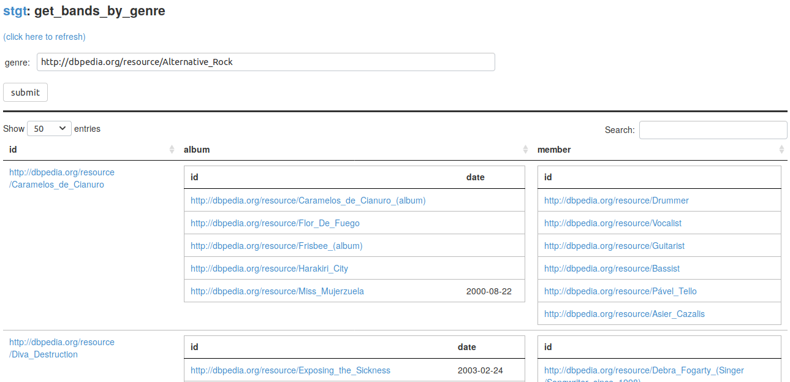

SPARQL Transformer - grlc - Tapas
=================================

This repository contains the files for a study on using [SPARQL
Transformer](https://github.com/D2KLab/sparql-transformer) together with
[grlc](http://grlc.io/) and [Tapas](https://github.com/peta-pico/tapas).

[get_bands_by_genre.json](get_bands_by_genre.json) shows an example of a SPARQL
Transformer query, which looks as follows when ran through grlc and accessed
through the Tapas interface:

...
